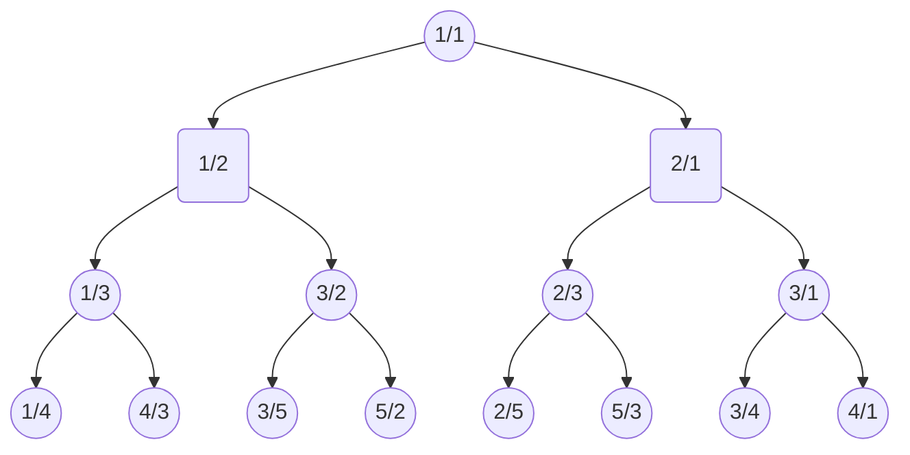

# The Calkin-Wilf tree: Enumerating the postive rational numbers

## The Calkin-Wilf tree

Here are the first few levels of the Calkin-Wilf tree


Each branch is generated by the following template
```mermaid
    graph TB
        A((n/d))-->B((n/(n+d)))
        A       -->C(((n+d)/d))
```

Every positive rational is in this tree, in reduced form.
(It may not be clear why until after we look at Euclid's algorithm.)

## The idea behind the enumeration

### Euclid's algorithm
Euclid's algorithm computes the [GCD](acronyms.md) of two natural numbers.

Here's an implementation:
```haskell
euclid :: Integer -> Integer -> Integer
euclid a b =
  if a==b
  then a                  -- done
  else
    if a>b
    then euclid (a-b) b   -- reduce 1st arg
    else euclid a (b-a)   -- reduce 2nd arg
```

### Tracing Euclid's Algorithm
Given any positive rational number it is possible to take the numerator and denominator as a pair of inputs to Euclid's algorithm.
Normally this algorithm is used to calculate the [GCD](acronyms.md) of the two inputs,
however, in this case we're more interested _how_ the GCD was found than in its value.

For example, taking the fraction 3/4 the trace is:
```
3 4 -- reduce 2nd arg / denominator
3 1 -- reduce 1st arg / numerator
2 1 -- reduce 1st arg / numerator
1 1 -- done
```

To reify the trace of the choices the algorithm takes at each step
we provide a constructor for each branch, and a subfield whereever a step is recursive.

```haskell
data Trace
  = Done
  | NStep Trace -- reduce numerator
  | DStep Trace -- reduce denominator
    deriving Show
```

Here's a derivative of Euclid's algorithm instrumented to compute the trace instead of the GCD.
```haskell
euclidT :: Integer -> Integer -> Trace
euclidT num denom =
  if num==denom
  then Done
    else
    if num>denom
    then NStep $ euclidT (num-denom)  denom
    else DStep $ euclidT  num        (denom-num)
```

For example `euclidT 3 4` gives
```
DStep (NStep (NStep Done))
```

### Observations

Claim: the Calkin-Wilf tree includes all positive rationals.

This is because, given any rational it's numerator and denominator can be input to the modified Euclidean algorithm.
That algorithm will terminate with a path that locates the rational number in the tree.
(By the way, termination is guaranteed since each recursive step decreases one of the inputs).

Claim: the rationals in the Calkin-Wilf tree are unique.

If two rationals are equal but in different form (eg 6/8 and 9/12) they generate the same trace,
    which is the trace that the reduced form takes.
Formally, the claim follows by induction on the tree.

Claim: the rationals in the Calkin-Wilf tree are in reduced form.

Formally, the claim follows by induction on the tree, and the fact that the following 3 terms are equal:

 - GCD(num,denom)
 - GCD(num-denom,denom)
 - GCD(num,denom-num)

## Enumerations
To enumerate the positive rationals, generate all distinct traces and convert them back into fractions.

### Obviously Correct Enumeration

```haskell
traces = Done:interleave (map NStep traces) (map DStep traces)
```

```haskell
rationals = map eval traces
```


```haskell
eval :: Trace -> Rational -- Integer
eval n =
  case n of
    Done    -> 1
    NStep m ->    1 +    eval m
    DStep m -> 1/(1 + 1/(eval m))
```

```haskell
interleave xs ys =
  case xs of
    []     -> ys
    (z:zs) -> z:interleave ys zs
```

## Direct Enumeration
```haskell
direct :: [Rational]
direct = 1:interleave
                (map (\x->    1+x)    direct)
                (map (\x-> 1/(1+1/x)) direct)
```
